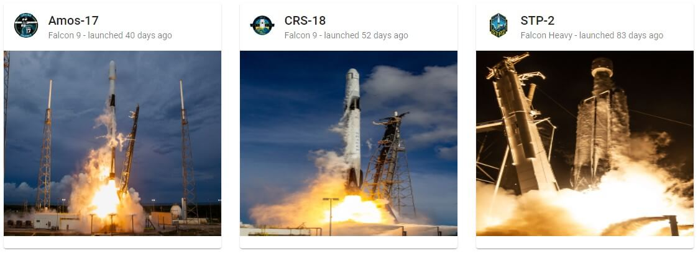

# Angular Spacex Graphql Codegen

## Mission

Utilizing GraphQL Code Generator for Angular services. The approach simplifies the process of querying data from the API and ensures type safety and consistency throughout the application.

## End Result




## Steps

1. Generate a new angular application with routing

   ```bash
   ng new angular-spacex-graphql-codegen --routing=true --style=css
   ```

   Make sure to delete the default template in `src/app/app.component.html`

1. Install the [Apollo VS Code plugin](https://marketplace.visualstudio.com/items?itemName=apollographql.vscode-apollo) and in the root of the project add `apollo.config.js`

   ```javascript
   module.exports = {
     client: {
       service: {
         name: 'angular-spacex-graphql-codegen',
         url: 'https://api.spacex.land/graphql/'
       }
     }
   };
   ```

   The extension at the SpaceX GraphQL API so we get autocomplete, type information, and other cool features in GraphQL files. You may need to restart VS Code.


 